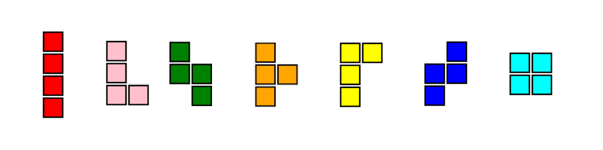

<h1> Tetris </h1>

 Simple old-school game. 

<h2>Pieces</h2>

<h2>Manual</h2>
<table>
  <tr>
    <td>
      <kbd>A</kbd>
    </td>
    <td>
      move left
    </td>
  </tr>
  <tr>
    <td>
      <kbd>D</kbd>
    </td>
    <td>
      move right
    </td>
  </tr>
  <tr>
    <td>
      <kbd>S</kbd>
    </td>
    <td>
      drop down
    </td>
  </tr>
  <tr>
    <td>
      <kbd>Spacebar</kbd>
    </td>
    <td>
      rotate
    </td>
  </tr>
</table>

<h2>Gameplay</h2>

https://user-images.githubusercontent.com/24891916/137629929-f6c1801a-773b-497d-8c9e-e7db8b8914d0.mp4

